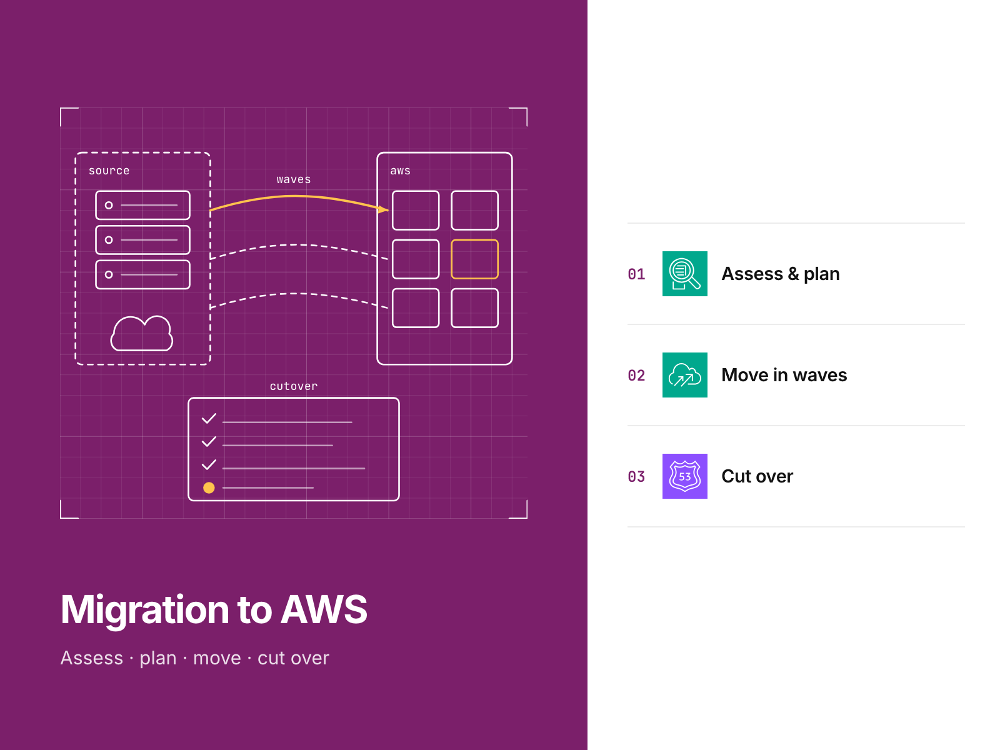
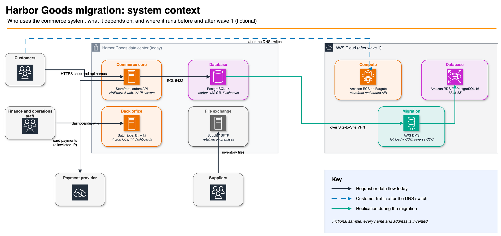

# AWS migration runbook sample

A proposed migration of a warehouse and inventory application to AWS, with an offline-checked cutover runbook and
rollback procedures.

[](https://github.com/gamaware/aws-migration-runbook-sample/actions/workflows/ci.yml)
[](LICENSE)




> **Fictional sample.** Harbor Goods and all data here are fictional. Each repository in this portfolio is a
> separate engagement with Harbor Goods, a fictional mid-size retailer. Account IDs are AWS documentation examples.

## Executive summary

Harbor Goods' storefront already runs on AWS. Its warehouse and inventory application still runs on 12 virtual machines
in a colocation data center: web app, inventory API and PostgreSQL 14. This repository is the migration deliverable:
inventory, 7R classification, wave plan, target Terraform, AWS DMS tasks, cutover runbook and acceptance criteria.
Scripts check that all of them agree.

- **Planned outcome (acceptance targets, not measured results):** wave 1 moves the application in one four-hour
  window; warehouse staff and the storefront's inventory calls cannot write for at most 30 minutes; a rollback stays
  possible for seven days with zero lost orders.
- **Findings:** 9 risks from discovery, 3 of them high: BI reads the replica that wave 1 retires, a table without a
  primary key, and a parcel carrier that allowlists the old egress address.
- **Top recommendations:** register the new egress addresses with the parcel carrier now; approve the replatform to
  ECS Fargate and RDS for PostgreSQL 16 moved with DMS full load plus CDC; hold the date only if the rehearsal
  finishes the freeze in 27 minutes or less.
- **Techniques:** dependency-driven waves with computed hybrid links, AWS DMS with a reverse CDC task for lossless
  rollback, Route 53 weighted records used as a single-writer switch, and plan files that Terraform, the checks and
  the runbook share.

## Inspect the deliverable

- Report: [`report/REPORT.md`](report/REPORT.md) and [`report/REPORT.pdf`](report/REPORT.pdf)
- Cutover runbook: [`runbooks/wave-1-cutover.md`](runbooks/wave-1-cutover.md), with
  [validation queries](runbooks/sql/validation.sql), [smoke tests](runbooks/smoke-tests.md) and
  [acceptance criteria](runbooks/acceptance-criteria.md)
- Plan: [7R classification](plan/classification.yaml), [waves](plan/waves.yaml), [sizing](plan/target.yaml),
  [data migration](plan/data-migration.yaml)
- DMS task definitions: [`migration/dms/`](migration/dms/README.md)
- Terraform: [`infra/terraform/envs/production`](infra/terraform/envs/production/main.tf) and five
  [modules](infra/terraform/modules/) with mocked tests
- Evidence: [`evidence/`](evidence/), regenerated by `make evidence`

## Scenario and acceptance criteria

Harbor Goods runs its warehouse and inventory application in one colocation data center: an HAProxy pair, two web app
and two inventory API servers, a PostgreSQL 14 primary with a replica (182 GB), a batch server, a BI server, a supplier
SFTP server and an intranet wiki. Warehouse staff and handheld scanners use the web app; the storefront, already on
AWS, calls the inventory API for stock levels and sends it fulfillment orders. Synthetic discovery data is in [`data/synthetic/`](data/synthetic/README.md).

Constraints: a write freeze of at most 30 minutes, recovery within 30 minutes with no data loss, a Sunday night
window, supplier contracts that pin the SFTP address, and a parcel carrier that allowlists the source IP.

Wave 1 is accepted when all ten [acceptance criteria](runbooks/acceptance-criteria.md) hold through seven days of
hypercare, among them 99.9 percent synthetic check success, inventory API p95 at or below 350 ms, a write freeze within
30 minutes and zero lost orders.

## Architecture



Users reach the application through two public names. Today the data center serves them; after wave 1, ECS Fargate
behind an Application Load Balancer serves them, with RDS for PostgreSQL 16 Multi-AZ as the database. AWS DMS copies
the data over a Site-to-Site VPN, first forward and then, after cutover, in reverse to keep the rollback path open.
The deployment view with the cutover path is [`docs/diagrams/wave-1-target.png`](docs/diagrams/wave-1-target.png);
sources are the `.drawio` files next to it.

## Verify locally

Prerequisites: Terraform 1.14.5 (1.11 or later works), TFLint 0.61.0, uv 0.12 or later (brings Python 3.13, PyYAML,
pytest, ruff and Checkov 3.3.19), GNU Make and diff. CI uses the same versions. No AWS account or credentials.

```bash
make verify
```

Expected output ends with `verify: all checks passed` after about a minute on a warm cache (the first run downloads
the AWS provider and the TFLint ruleset). It runs ruff, the pytest suite, the plan rules (PLAN-01 to PLAN-10), the
runbook rules (RUN-01 to RUN-16), `terraform fmt`, `validate` and the mocked `terraform test` runs in six roots,
TFLint, Checkov, the evidence reproducibility check and the report checks.

Optional targets:

| Target | What it does | Needs |
| --- | --- | --- |
| `make report` | Renders `report/REPORT.pdf` from `report/REPORT.md` with the pandoc/latex image CI uses | Docker |
| `make sql-check` | Runs the validation queries on PostgreSQL 14 and 16 and proves V-05 catches a stale sequence | Docker |
| `make test-live` | Manual. Applies a network and database slice to the sandbox account, asserts, destroys, then checks nothing tagged is left | AWS `dev` profile |

`make test-live` shows the caller identity first, asks for confirmation, tags everything `purpose=portfolio-test`,
lets `terraform test` destroy the resources and lists anything left behind. It costs under USD 1 per run. Its logs go
to `build/live/`, which is never committed.

## Repository map

```text
data/synthetic/        discovery inventory: servers, applications, dependencies, databases, DNS, jobs (CSV)
plan/                  7R classification, waves and hybrid links, target sizing, data-migration plan (YAML)
migration/dms/         DMS table mappings and task settings, read by Terraform
infra/terraform/
  modules/             network, app, database, dms, dns, each with tests/ using mock providers
  envs/production/     wave 1 root; reads plan/ and data/synthetic/
  tests/               shared mocks and the live-test root
runbooks/              cutover runbook, smoke tests, acceptance criteria, validation SQL, DNS change batches
scripts/               plan, runbook, evidence and report checks (harbor/), report and live-test scripts
tests/                 pytest: each rule passes on the repository and fails on a planted mistake
evidence/              E-01 to E-08, generated
report/                REPORT.md (canonical) and REPORT.pdf
docs/                  methodology, ADRs, diagrams, cover and social preview
```

## Decisions and trade-offs

Architecture decision records follow the *Fundamentals of Software Architecture* (2nd ed.) format.

| Number | Title | Status |
| --- | --- | --- |
| [0001](docs/adr/0001-replatform-to-ecs-fargate-and-rds.md) | Replatform the warehouse application tier to ECS Fargate and Amazon RDS | Accepted |
| [0002](docs/adr/0002-dms-full-load-cdc-with-reverse-replication.md) | Move the data with AWS DMS full load plus CDC, and keep a reverse task for rollback | Accepted |
| [0003](docs/adr/0003-route53-weighted-records-as-a-single-writer-switch.md) | Use Route 53 weighted records as a switch, never as a traffic split | Accepted |
| [0004](docs/adr/0004-plan-files-as-the-single-source-of-truth.md) | Keep the plan in data files that Terraform, the checks and the runbook share | Accepted |

## Security and quality gates

- **CI** ([`ci.yml`](.github/workflows/ci.yml)) runs `make verify` and calls the shared, SHA-pinned workflows from
  [gamaware/.github](https://github.com/gamaware/.github): Markdown, link and Vale checks, actionlint and zizmor,
  gitleaks, Semgrep, Trivy and Checkov, and the report build. Every workflow starts from `permissions: {}`, and no
  job gets cloud credentials.
- **Pre-commit** runs hygiene hooks, detect-secrets, gitleaks, markdownlint, ruff, `terraform fmt`, `validate`,
  TFLint, terraform-docs, Checkov, shellcheck, shellharden, actionlint, zizmor and conventional commits.
- **Checkov** skips sit inside the resource with a reason; skips that defer work name a risk in the report
  (RISK-07 to RISK-09), and a check fails if the report drops one.

## Limits and production adaptations

- Everything is fictional. No real account, address or company appears; values come from AWS documentation ranges.
- Mocked tests prove the Terraform's properties and its agreement with the plan, not that AWS accepts every setting.
  The live test covers the network and database slice only.
- Waves 2 and 3 are planned to the dependency level; their runbooks are written after wave 1 exits.
- A real engagement adds a cost estimate, a rehearsal on a restored copy of production, the application's own
  container build pipeline, AWS WAF rules, secret rotation and DMS certificate verification (RISK-07 to RISK-09).

## Related work

Part of the [AWS DevOps portfolio](https://github.com/gamaware/aws-devops-portfolio); it backs the "Migration to AWS"
service: [Migration to AWS on Upwork](https://www.upwork.com/freelancers/~014b3520cf9e140103). The method is the one
Alex uses in audits for ITESO and freelance clients in Guadalajara. Contribution, conduct and support guidelines are
inherited from [gamaware/.github](https://github.com/gamaware/.github); see also [SECURITY.md](SECURITY.md) and
[CHANGELOG.md](CHANGELOG.md).

## License

[MIT](LICENSE)
