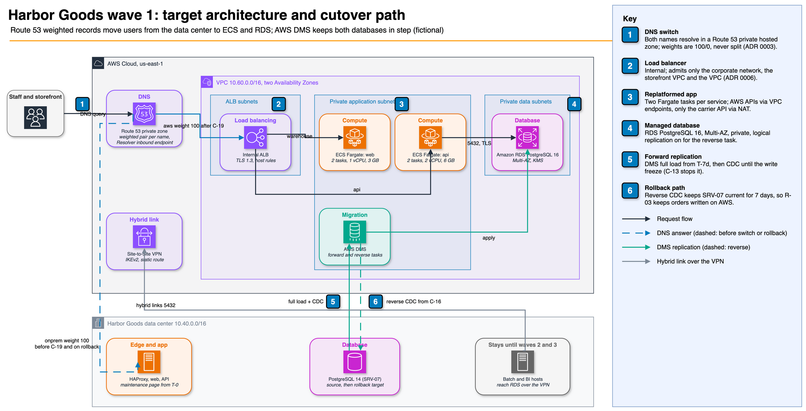

# Harbor Goods: migration to AWS

> Fictional sample deliverable. The company Harbor Goods and all people, servers and data described here are invented.
> AWS documentation examples supply the account and network values. The repository files and the evidence regenerated
> by `make evidence` provide every number in this document.

| Item | Value |
| --- | --- |
| Client | Harbor Goods, a mid-size online retailer (fictional) |
| Scope | 12 servers in one data center; wave 1 in full, waves 2 and 3 at plan level |
| Target | AWS, `us-east-1`, one production account (`123456789012`) |
| Deliverables | Inventory, 7R classification, wave plan, Terraform, DMS tasks, cutover runbook, acceptance criteria |
| Revision | 1.0 |

## Executive summary

A four-hour Sunday window allows Harbor Goods to migrate its online store to AWS, with ordering unavailable to
customers for no more than 30 minutes. During the seven days that follow, the store can move back to the data center
at any time without losing orders.

The nine risks identified during discovery divide equally into high, medium and low severity; the complete register
appears under "Risks." Had the three high-severity issues gone undetected, cutover would have failed.

| Severity | Count | Examples |
| --- | --- | --- |
| High | 3 | BI reads the replica that wave 1 retires; a table without a primary key; the payment provider allowlists the source IP |
| Medium | 3 | Nightly jobs inside the window; one-hour DNS TTL; PostgreSQL 14 to 16 during the move |
| Low | 3 | No WAF yet; application secret without rotation; DMS TLS without certificate checks |

The three priority recommendations are:

1. Request the payment provider's allowlisting of the new egress addresses now (prerequisite P-04). This prerequisite
   takes the longest to arrange, and go-live cannot proceed without it.
2. Approve the proposed first wave, moving the storefront and orders API to ECS Fargate and replatforming the database
   onto RDS for PostgreSQL 16 Multi-AZ. Use AWS DMS for full load followed by change data capture, with a reverse task
   supporting rollback.
3. Complete the full rehearsal (P-09); keep the scheduled date only if the freeze takes no more than 27 minutes (G-04).

## Scope and method

[`docs/methodology.md`](../docs/methodology.md) defines the sequence: discovery, 7 Rs classification, dependency-based
waves, sizing from measurements, data migration planning, a runbook expressed as data and a target built as code.
Automated checks cover every step. E-06 records the plan checks, E-07 records the runbook checks, and E-08 contains the
Terraform test results.

Application code changes and a cost estimate are excluded; a real engagement would include an AWS Pricing Calculator
export. Detailed runbooks for waves 2 and 3 are also outside this scope and will be written after wave 1 exits.

## Current state

The inventory (E-01) lists eight applications across twelve servers. An HAProxy pair fronts two storefront servers and
two orders API servers. PostgreSQL 14 runs on a primary and streaming replica, holding 182 GB across 55 tables in five
schemas. The remaining servers host nightly batch jobs, a self-hosted BI tool, supplier SFTP and a rarely used intranet
wiki. Both the storefront and API tolerate a 30-minute write freeze and require recovery within 30 minutes (RTO), with
zero data loss (RPO 0).

## 7R classification

| Strategy | Servers | Why |
| --- | --- | --- |
| Replatform | SRV-01 to SRV-07 | Stateless web and API tiers run as containers unchanged; a managed load balancer and database remove hand patching |
| Retire | SRV-08, SRV-12 | Multi-AZ replaces the replica; the wiki has no edits in the discovery sample |
| Rehost | SRV-09 | Batch jobs depend on local paths; containerizing them needs code changes |
| Repurchase | SRV-10 | 14 dashboards move to a managed BI service |
| Retain | SRV-11 | Supplier contracts allowlist the SFTP address |

For each server, [`plan/classification.yaml`](../plan/classification.yaml) and E-02 record the selected target, the
reason for choosing it and the alternative rejected. Refactoring is not assigned to any server because no business
driver justifies that rework as part of the migration (ADR 0001).

## Wave plan

| Wave | Servers | Exit criterion |
| --- | --- | --- |
| 1 Commerce core | SRV-01 to SRV-08 | All acceptance criteria met after seven days of hypercare |
| 2 Batch and intranet | SRV-09, SRV-12 | Three nightly runs match the on-premises row counts |
| 3 Reporting | SRV-10 | Finance signs off the rebuilt dashboards after one month-end close |
| Retained | SRV-11 | Revisit when supplier contracts renew |

Between waves, three connections use the Site-to-Site VPN (E-03). After wave 1, batch and BI connect to RDS; after
wave 2, batch connects to the retained SFTP server. Database access through Terraform is limited to the batch and BI
hosts, using the `/32` addresses specified in the plan.

## Target architecture

Customer traffic follows Route 53 weighted records to the selected destination. Using a TLS 1.3 policy, an Application
Load Balancer directs each host name to its ECS Fargate service in private subnets. The RDS for PostgreSQL 16 database
uses Multi-AZ and a customer managed KMS key for encryption; its data subnets have no internet route. From the
application subnets, AWS DMS connects to the data center through the VPN and to RDS within the VPC.

Discovery p95 measurements determine sizing, with 25 percent headroom (E-04). Each orders API task has 2 vCPU and 6 GB,
and each storefront task has 1 vCPU and 3 GB. The database uses a `db.r7g.2xlarge` instance and 400 GB of gp3 storage.

## Data migration

At T-7d, the forward task begins a full load of all five schemas, then streams changes up to the write freeze (E-05).
DMS cannot keep `audit.request_log` synchronized because the table lacks a primary key and its retention job deletes
rows. A `pg_dump` export transfers its history at T-24h; `\copy` transfers the remaining rows during the freeze.
Manual steps M-01 to M-05 handle sequences, roles and grants, which DMS does not copy. When cutover occurs, a reverse
task begins streaming changes from RDS to the data center, allowing rollback without data loss after go-live
(ADR 0002).

## Cutover and rollback

The [runbook](../runbooks/wave-1-cutover.md) defines 13 prerequisites and 23 timed steps, with 8 go/no-go criteria
distributed across three checkpoints. It also includes 7 validation queries, 7 rollback triggers and 3 rollback
procedures:

| Phase | Window | Rollback | Time to roll back |
| --- | --- | --- | --- |
| Preparation | T-72h to T-0 | R-01: abort, nothing to undo | 15 min |
| Write freeze | T-0 to T+27m | R-02: restart the data center application; RDS is reloaded before the next attempt | 15 min |
| Hypercare | T+27m to T+7d | R-03: maintenance page on AWS, drain the reverse task, flip DNS back | 25 min |

For both DNS names, the switch sets Route 53 weights to 0/100 from 100/0. Because the database permits only one writer,
the Terraform module rejects intermediate weights (ADR 0003). Three days before the switch, the TTL is reduced from
3600 seconds to 60 seconds. Fixture-based execution on PostgreSQL 14 and 16 verified the validation queries
(`make sql-check`).

## Acceptance criteria

Acceptance of wave 1 requires seven days of hypercare and satisfaction of all ten conditions in
[`runbooks/acceptance-criteria.md`](../runbooks/acceptance-criteria.md). These include a 99.9 percent pass rate for
synthetic checks, orders API p95 no higher than 350 ms, an actual write freeze of no more than 30 minutes, zero lost
orders and completion of a point-in-time restore within 60 minutes.

## Risks

| ID | Severity | Risk | Evidence | Treatment |
| --- | --- | --- | --- | --- |
| RISK-01 | High | BI dashboards read the replica that wave 1 retires | E-03 | Repoint BI to RDS over the VPN in wave 1 (C-20) |
| RISK-02 | High | `audit.request_log` has no primary key and a delete job | E-05 | Exclude from DMS; export the history and copy the tail in the freeze (M-05) |
| RISK-03 | High | The payment provider allowlists the data center egress address | E-01 | Register the NAT gateway addresses before cutover (P-04) |
| RISK-04 | Medium | JOB-01 and JOB-03 run inside the window against the database | E-07 | Disable at T-80m (C-06), final dump at C-07, re-enable batch after the switch |
| RISK-05 | Medium | One-hour TTL on the public names | E-07 | Lower to 60 s at T-72h (C-01) |
| RISK-06 | Medium | PostgreSQL 14 to 16 during the move | E-04 | Full rehearsal on 16 (P-09); smoke tests before the switch |
| RISK-07 | Low | No AWS WAF in front of the load balancer (none on premises either) | E-08 | Add managed rules in count mode during hypercare, then block |
| RISK-08 | Low | The application database secret has no rotation | E-08 | Enable rotation once the API reloads credentials, after hypercare |
| RISK-09 | Low | DMS endpoints use TLS without certificate verification | E-08 | Import the RDS and data center CAs and switch to `verify-full` |

## Limits

- All material is fictional and synthetic, so none of the findings apply to an actual system.
- Offline testing establishes consistency among the plan, runbook and Terraform, and confirms Terraform's intended
  properties. It does not establish that AWS accepts every setting. The manually run `make test-live` checks the
  network and database slice in a sandbox account.
- Planning for waves 2 and 3 covers dependencies; after wave 1 exits, their runbooks will be developed using the same
  format.

## Evidence index

| ID | File | Produced by |
| --- | --- | --- |
| E-01 | [Inventory summary](../evidence/E-01-inventory.md) | `scripts/build_evidence.py` |
| E-02 | [Classification and waves](../evidence/E-02-classification.md) | `scripts/build_evidence.py` |
| E-03 | [Dependencies by wave](../evidence/E-03-dependencies.md) | `scripts/build_evidence.py` |
| E-04 | [Target sizing](../evidence/E-04-sizing.md) | `scripts/build_evidence.py` |
| E-05 | [DMS coverage](../evidence/E-05-dms-coverage.md) | `scripts/build_evidence.py` |
| E-06 | [Plan checks](../evidence/E-06-plan-checks.txt) | `scripts/check_plan.py` rules |
| E-07 | [Runbook checks](../evidence/E-07-runbook-checks.txt) | `scripts/check_runbook.py` rules |
| E-08 | [Terraform tests](../evidence/E-08-terraform-tests.txt) | `terraform test` with mock providers |

---

Fictional sample prepared for a portfolio. Harbor Goods does not exist.
